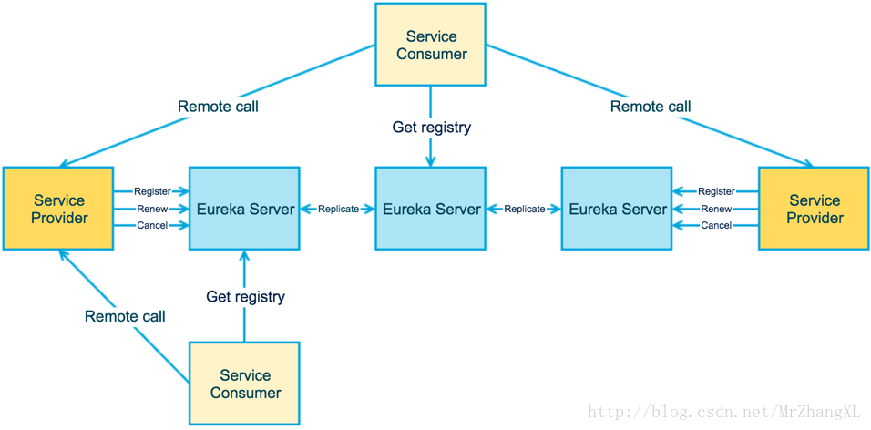

# SpringCloud eureka service 源码解析
## eureka简介
[eureka简介](https://www.cnblogs.com/wangdaijun/p/6851027.html)

[eureka源码时序图](https://blog.csdn.net/qiansg123/article/details/80127590)

[eureka 服务端源码解析](https://www.cnblogs.com/rickiyang/p/11802413.html)

[eureka Guice使用](https://www.cnblogs.com/snowInPluto/p/5993097.html)

[eureka 缓存机制](https://www.cnblogs.com/yixinjishu/p/10871243.html)

[eureka 如何承载大型系统的千万级访问](https://mp.weixin.qq.com/s/qjMphuPiihBmU2QtFMIfzw)

[eureka client 注册服务分析](https://www.xssyun.com/wangluo/itsq/2760.html)

[eureka client 获取全部注册信息](https://blog.csdn.net/rubbertree/article/details/90294158)
## 涉及概念
* 服务注册：Eureka Client会通过发送REST请求的方式向Eureka Server注册自己的服务，提供自身的元数据，比如 IP 地址、端口、运行状况指标的URL、主页地址等信息。Eureka Server接收到注册请求后，就会把这些元数据信息存储在一个ConcurrentHashMap中。
* 服务续约：在服务注册后，Eureka Client会维护一个心跳来持续通知Eureka Server，说明服务一直处于可用状态，防止被剔除。Eureka Client在默认的情况下会每隔30秒发送一次心跳来进行服务续约。
* 服务同步：Eureka Server之间会互相进行注册，构建Eureka Server集群，不同Eureka Server之间会进行服务同步，用来保证服务信息的一致性。
* 获取服务：服务消费者（Eureka Client）在启动的时候，会发送一个REST请求给Eureka Server，获取上面注册的服务清单，并且缓存在Eureka Client本地，默认缓存30秒。同时，为了性能考虑，Eureka Server也会维护一份只读的服务清单缓存，该缓存每隔30秒更新一次。
* 服务调用：服务消费者在获取到服务清单后，就可以根据清单中的服务列表信息，查找到其他服务的地址，从而进行远程调用。Eureka有Region和Zone的概念，一个Region可以包含多个Zone，在进行服务调用时，优先访问处于同一个Zone中的服务提供者。
* 服务下线：当Eureka Client需要关闭或重启时，就不希望在这个时间段内再有请求进来，所以，就需要提前先发送REST请求给Eureka Server，告诉Eureka Server自己要下线了，Eureka Server在收到请求后，就会把该服务状态置为下线（DOWN），并把该下线事件传播出去。
* 服务剔除：有时候，服务实例可能会因为网络故障等原因导致不能提供服务，而此时该实例也没有发送请求给Eureka Server来进行服务下线，所以，还需要有服务剔除的机制。Eureka Server在启动的时候会创建一个定时任务，每隔一段时间（默认60秒），从当前服务清单中把超时没有续约（默认90秒）的服务剔除。
* 自我保护：既然Eureka Server会定时剔除超时没有续约的服务，那就有可能出现一种场景，网络一段时间内发生了异常，所有的服务都没能够进行续约，Eureka Server就把所有的服务都剔除了，这样显然不太合理。所以，就有了自我保护机制，当短时间内，统计续约失败的比例，如果达到一定阈值，则会触发自我保护的机制，在该机制下，Eureka Server不会剔除任何的微服务，等到正常后，再退出自我保护机制。
## 基本原理
* Eureka Server 提供服务注册服务，各个节点启动后，会在Eureka Server中进行注册，这样Eureka Server中的服务注册表中将会存储所有可用服务节点的信息，服务节点的信息可以在界面中直观的看到；
* Eureka Client 是一个Java 客户端，用于简化与Eureka Server的交互，客户端同时也具备一个内置的、使用轮询负载算法的负载均衡器；
* 在应用启动后，将会向Eureka Server发送心跳(默认周期为30秒)，如果Eureka Server在多个心跳周期没有收到某个节点的心跳，Eureka Server 将会从服务注册表中把这个服务节点移除(默认90秒)；
* Eureka Server之间将会通过复制的方式完成数据的同步；
* Eureka Client具有缓存的机制，即使所有的Eureka Server 都挂掉的话，客户端依然可以利用缓存中的信息消费其它服务的API；

## eureka 核心模块

由上图可以看出，eureka主要有三种角色：
1. Eureka Server

eureka服务端，主要用来做服务的注册与发现
2. Service Provider

服务的实际提供方，会将服务注册到Eureka Server上
3. Service Consumer

服务消费方，从Eureka Server获取服务列表，向Service Provider发起真实调用请求

> 这三个角色是逻辑上的划分，可能在使用时，这几个角色可以是同一个实例；
  一个Service Provider既可以是Service Consumer，也可以是Service Provider

上图进一步展示了3个角色之间的交互。
1. ServiceProvider会向Eureka Server做Register（服务注册）、Renew（服务续约）、Cancel（服务下线）等操作。
2. EurekaServer之间会做注册服务的同步，从而保证状态一致
3. ServiceConsumer会向Eureka Server获取注册服务列表，并消费服务